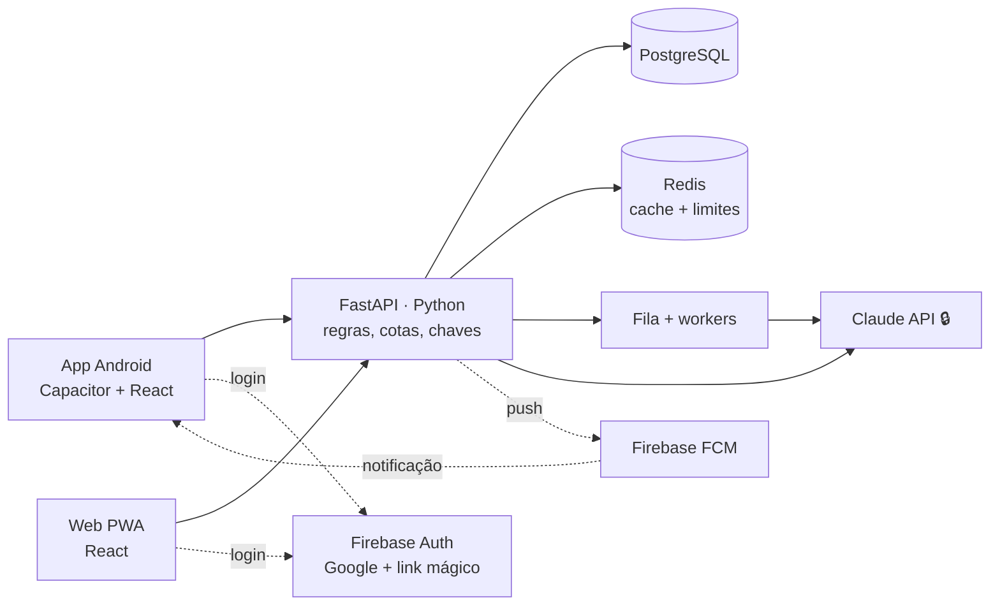

# VouAli — Roadmap de produto

De app de uma viagem a produto público Android, **sem desestabilizar a viagem real
de Nova York (6–13/out/2026)**.

---

## 1. Onde estamos

| | Estado |
|---|---|
| **Produto** | PWA completa: roteiro, orçamento, checklist, notas e o assistente **Ali** (chat, geração de roteiro e dicas) |
| **Multiusuário** | ❌ Não — um único conjunto de dados, protegido por senha compartilhada (`TRIP_TOKEN`) |
| **Banco** | SQLite em arquivo (volume do Railway) |
| **Testes** | ✅ 52 (39 backend + 13 frontend), rodando em CI |
| **Ambientes** | `main` → produção. Staging a criar |

> **Bloqueador para publicar:** hoje qualquer pessoa que instalasse o app veria e
> editaria **a mesma viagem**, gastando a chave de IA do dono. A Fase 1 existe
> para resolver exatamente isso.

---

## 2. Arquitetura alvo

**Princípio central:** cliente burro, **servidor dono das regras e das chaves**.
A chave da Claude nunca vai para o aparelho.

### Linguagens

| Camada | Linguagem | Peso |
|---|---|---|
| Interface (app + web) | JavaScript/JSX (React) | ~90% do que escrevemos |
| Backend | Python (FastAPI) | ~10% |
| Banco | SQL (PostgreSQL) | Consultas e migrações |
| Casca Android/iOS | Kotlin / Swift | Gerada pelo Capacitor — quase não tocamos |

### Decisões travadas

| Decisão | Escolha | Por quê |
|---|---|---|
| Empacotamento | **Capacitor** | Uma base para web + Android + iOS; preserva o design system. React Native exigiria manter duas interfaces |
| Login | **Firebase Auth** (Google + link mágico) | Faz o que foi escolhido, sem escrever código sensível de senha |
| Banco | **PostgreSQL próprio** | Sem aprisionamento, custo previsível; Firestore obrigaria a reescrever o backend e ainda exigiria servidor para a IA |
| Push | **FCM** | Único caminho no Android |
| Modelo de custo | **Gratuito com cota generosa** | Simples de comunicar e previsível |

---

## 3. Fases

### ✅ Fase 0 — Fundação de engenharia *(concluída)*
- 52 testes automatizados; `test_migracao.py` trava as garantias de preservação
  dos dados (migração, backup intocado, idempotência, concorrência 409).
- CI no GitHub Actions (testes + build a cada push/PR).
- `GET /api/health` com ambiente, IA e auth.
- Documentação dos ambientes.
- ⏳ **Pendente (ação manual):** criar o serviço de **staging** no Railway
  (branch `staging`, volume e senha próprios) — ver README.

### Fase 1 — Multiusuário *(o coração)*
- Migrar SQLite → **PostgreSQL** gerenciado.
- **Contas** com Firebase Auth; backend valida o token; token guardado com
  segurança no Android.
- **Isolamento**: cada usuário enxerga só as suas viagens.
- **Compartilhamento de viagem** com papéis (dono/editor) — não é extra, é o caso
  de uso real (duas pessoas na mesma viagem).
- Migração dos dados atuais para a conta do dono, sem perder nada.

### Fase 2 — Custo e sustentabilidade
- **Cotas por usuário** (mensagens do Ali e gerações de roteiro por mês).
- **Rate limit por conta** (hoje é global e em memória).
- **Roteamento de modelo**: Haiku para conversa simples, Sonnet para geração.
- Teto de gasto global como fusível.

### Fase 2.5 — Pronta para escala
> Executada **antes de publicar**, não antes de existir. Cada item corrige uma
> fraqueza concreta do código atual.

**Infraestrutura**
| Item | Corrige |
|---|---|
| **Redis** | `_rate_ok()` é em memória: com 2+ instâncias o limite vira ficção |
| **Fila + workers** | Geração de roteiro (~15s) segura um worker HTTP e estoura sob carga |
| **CDN (Cloudflare)** | Estáticos consomem CPU do backend |
| **Backend sem estado + réplicas** | Permite escalar horizontalmente |
| **Pooling e índices no Postgres** | Conexões e consultas sob concorrência |

**Eficiência de dados**
| Item | Corrige |
|---|---|
| **ETag/304 ou SSE** | Consulta a cada 12s por cliente: 10 mil usuários ≈ 800 req/s só perguntando "mudou?" |
| **Escrita por entidade** | Hoje marcar uma parada reescreve a viagem inteira |

**IA — onde está o custo de verdade**
| Item | Ganho |
|---|---|
| **Prompt caching** | A persona do Ali + o roteiro são reenviados a cada mensagem; em cache custam uma fração |
| **Streaming (SSE)** | Resposta palavra a palavra — muda a percepção de velocidade |
| **Cache de conteúdo comum** | "O que fazer em Lisboa" é igual para milhares de usuários: gerar uma vez |
| **Métricas de token/custo por usuário** | Sem isso não há como precificar nem detectar abuso |

**Observabilidade**: Sentry (erros), logs estruturados, painel de custo de IA.

### Fase 3 — App Android (Capacitor)
- Base de API configurável + CORS, deep links, botão voltar, ícone adaptativo,
  splash, barra de status, armazenamento seguro do token.
- **Push (FCM)**: lembrete do dia, "faltam X dias", pendências do "comprar antes".
- Offline com sincronização.

### Fase 4 — Conformidade e publicação
- Política de privacidade e termos.
- **LGPD/GDPR**: exportar dados e **excluir conta** — o Google exige exclusão
  dentro do app **e** por link público.
- Formulário *Data safety*, keystore de assinatura, **Play Console (US$ 25)**.
- ⚠️ Contas **pessoais** hoje exigem teste fechado com ~12 testadores por 14 dias;
  contas de **organização** não. Confirmar na abertura (a regra muda).

### Fase 5 — iOS
Mesma base via Capacitor. Exige **Mac + Apple Developer (US$ 99/ano)** ou serviço
de build em nuvem (o desenvolvimento é em Windows).

---

## 4. Custos previstos

| Item | Valor |
|---|---|
| Play Console | US$ 25 (uma vez) |
| Backend + PostgreSQL (Railway) | ~US$ 5–20/mês no início |
| Redis | ~US$ 5–10/mês (a partir da Fase 2.5) |
| **API da Claude** | **Variável, proporcional ao uso — o item a controlar** |
| Firebase Auth + FCM | Gratuito nas faixas iniciais |
| Apple (se iOS) | US$ 99/ano |
| Sentry / CI | Planos gratuitos atendem no começo |

---

## 5. Riscos

| Risco | Mitigação |
|---|---|
| 🔴 **Quebrar a viagem de outubro** | Produção congelada; tudo passa por staging; testes de preservação no CI |
| 🔴 **Custo de IA descontrolado** | Cotas (Fase 2) **antes** de qualquer publicação; teto global |
| 🟠 **Escopo virar produto** | Fases com valor entregue em cada uma |
| 🟠 **Suporte a usuários reais** | Considerar antes de abrir ao público |

---

## 6. Regra de ouro

> Enquanto a viagem de NY não terminar, **produção não é laboratório**.
> Código novo nasce em `staging`, passa nos testes e só então vai para `main`.
